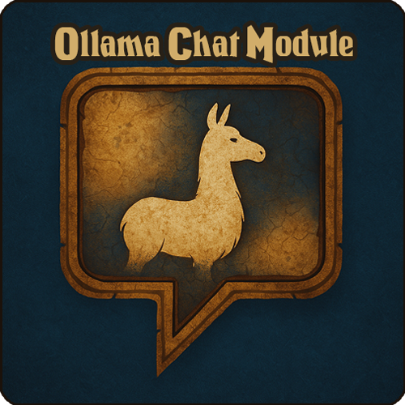

<p align="center">
  
</p>

# AzerothCore + Playerbots Module: mod-ollama-chat

> [!CAUTION]
> This module is very early stages and can bog down your server due to the nature of running local LLM. Please proceed with this in mind.

## Overview

***mod-ollama-chat*** is an AzerothCore module that enhances the Player Bots module by integrating external language model (LLM) support via the Ollama API. This module enables player bots to generate dynamic, in-character chat responses using advanced natural language processing locally on your computer (or remotely hosted). Bots are enriched with personality traits, random chatter triggers, and context-aware replies that mimic the language and lore of World of Warcraft.

## Features

- **Ollama LLM Integration:**  
  Bots generate chat responses by querying an external Ollama API endpoint. This enables natural and contextually appropriate in-game dialogue.

- **Player Bot Personalities:**  
  When enabled, each bot is assigned a personality type (e.g., Gamer, Roleplayer, Trickster) that modifies its chat style. Personalities influence prompt generation and result in varied, immersive responses.

- **Context-Aware Prompt Generation:**  
  The module gathers extensive context about both the bot and the interacting player—including class, race, role, faction, guild, and more—to generate prompts for the LLM. A comprehensive WoW cheat sheet is appended to every prompt to ensure the LLM replies with accurate lore, terminology, and in-character language spanning Vanilla WoW, The Burning Crusade, and Wrath of the Lich King.

- **Random Chatter:**  
  Bots can periodically initiate random, environment-based chat when a real player is nearby. This feature adds an extra layer of immersion to the game world.

- **Chat Memory (Conversation History):**  
  Bots now have configurable short-term chat memory. Recent conversations between each player and bot are stored and included as context in every LLM prompt, giving responses better context and continuity.

  Bots now recall your recent interactions—responses will reflect the last several lines of chat with each player.

- **Blacklist for Playerbot Commands:**  
  A configurable blacklist prevents bots from responding to chat messages that start with common playerbot command prefixes, ensuring that administrative commands are not inadvertently processed. Additional commands can be appended via the configuration.

- **Asynchronous Response Handling:**  
  Chat responses are generated on separate threads to avoid blocking the main server loop, ensuring smooth server performance.

- **Live Configuration & Personality Reload:**  
  Reload the module’s config and personality packs in-game or from the server console, without restarting.

- **Event-Based Chatter:**  
  Player bots now comment on key in-game events such as quest completion, rare loot, deaths, PvP kills, leveling up, duels, learning spells, and achievements. Remarks are context-aware, immersive, and personality-driven, making the world feel much more alive.

- **Think Mode Support:**  
  Bots can leverage LLM models that have reasoning/think modes. Enable internal reasoning for models that support it by setting `OllamaChat.ThinkModeEnableForModule = 1` in **mod-ollama-chat.conf**. When enabled, the API request includes the `think` flag and the bot omits all `thinking` responses from its final reply.

- **Live Reload for Personalities and Settings:**  
  Instantly reload all mod-ollama-chat configuration and personality packs in-game using the `.ollama reload` command with a GM level account or use `ollama reload` from the server console. No server restart required—updates to `.conf` or personality packs (`.sql` files) are applied immediately.

## Installation

> [!IMPORTANT]
> Prerequisite dependencies have only been verified to work on macOS Monterey 12.7.6.  
> If you encounter any issues or resolve problems related to dependencies on your OS, please open an issue describing the problem, the solution, and your OS version. I will update the README accordingly.

1. **Prerequisites:**
   - Ensure you have liyunfan1223's AzerothCore (https://github.com/liyunfan1223/azerothcore-wotlk) installation with the Player Bots (https://github.com/liyunfan1223/mod-playerbots) module enabled.
   - The module depends on:
     - cURL (https://curl.se/libcurl/)
     - fmtlib (https://github.com/fmtlib/fmt)
     - nlohmann/json (https://github.com/nlohmann/json)
     - Ollama LLM support – set up a local instance of the Ollama API server with the model of your choice. More details at https://ollama.com

2. **Clone the Module:**
   ```bash
   cd /path/to/azerothcore/modules
   git clone https://github.com/DustinHendrickson/mod-ollama-chat.git
   ```

3. **Recompile AzerothCore:**
   ```bash
   cd /path/to/azerothcore
   mkdir build && cd build
   cmake ..
   make -j$(nproc)
   ```

4. **Configuration:**
   Copy the default configuration file to your server configuration directory and change to match your setup (if not already done):
   ```bash
   cp /path/to/azerothcore/modules/mod-ollama-chat/mod-ollama-chat.conf.dist /path/to/azerothcore/etc/config/mod-ollama-chat.conf
   ```

5. **Restart the Server:**
   ```bash
   ./worldserver
   ```

## Configuration Options

> For a complete list of all available configuration options with comments and defaults, see `mod-ollama-chat.conf.dist` included in this repository.

## How It Works

1. **Chat Filtering and Triggering**  
   When a player (or bot) sends a chat message, the module checks the message’s type, distance, and if it starts with any configured blacklist command prefix. Only eligible messages in range and not matching the blacklist will trigger a bot response.

2. **Bot Selection**  
   The system gathers all bots within the relevant distance, determines eligibility based on player/bot reply chance, and caps responses per message using `MaxBotsToPick` and related settings.

3. **Prompt Assembly**  
   For each reply, a prompt is assembled by combining configurable templates with live in-game context: bot/player class, race, gender, role/spec, faction, guild, level, zone, gold, group, environment info, personality, and if enabled, recent chat history between that player and the bot.

4. **LLM Request**  
   The prompt is sent to the Ollama API using the configured model and parameters. All LLM requests run asynchronously, ensuring no lag or blocking of the server.

5. **Response Routing**  
   Bot responses are routed back through the appropriate chat channel in game, whether it’s say, yell, party or general.

6. **Personality Management**  
   If RP personalities are enabled, each bot uses its assigned personality template. Personality definitions can be changed on the fly and reloaded live—no server restart required.

7. **Random & Event-Based Chatter**  
   In addition to responding to direct chat, bots will occasionally generate random environment-aware lines when real players are nearby, and will also react to key in-game events (e.g., PvP/PvE kills, loot, deaths, quests, duels, level-ups, achievements, using objects) using context-specific templates and personalities.

8. **Live Reloading**  
   You can hot-reload the module config and personality packs in-game using the `.ollama reload` GM command or from the server console. All changes take effect immediately without requiring a restart.

9. **Fully Configurable**  
   All settings—reply logic, distances, frequencies, blacklist, prompt templates, chat history, personalities, random/event chatter, LLM params, and more—are controlled via `mod-ollama-chat.conf` and can be adjusted and reloaded live at any time.

## Personality Packs

`mod-ollama-chat` supports Personality Packs, which are collections of personality templates that define how bots roleplay and interact in-game.

- To use a Personality Pack, download or create a `.sql` file named in the format `YYYY_MM_DD_personality_pack_NAME.sql`.

- Place the `.sql` file in `modules/mod-ollama-chat/data/sql/characters/base/`.

- The module will automatically detect and apply any new Personality Packs when the server starts or updates—no manual SQL import required.

Want to create your own pack or download packs made by the community?  

Visit the [Personality Packs Discussion Board](https://github.com/DustinHendrickson/mod-ollama-chat/discussions)

## Debugging

For detailed logs of bot responses, prompt generation, and LLM interactions, enable debug mode via your server logs or module-specific settings.

## Troubleshooting

It's advised to turn off the normal Player Bots chat in your `playerbots.conf` by setting  `AiPlayerbot.EnableBroadcasts = 0`

## License

This module is released under the GNU GPL v3 license, consistent with AzerothCore's licensing.

## Contribution

Developed by Dustin Hendrickson

Pull requests, bug reports, and feature suggestions are welcome. Please adhere to AzerothCore's coding standards and guidelines when submitting contributions.
